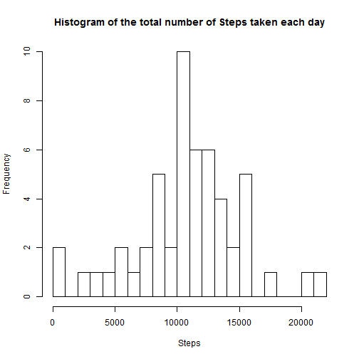
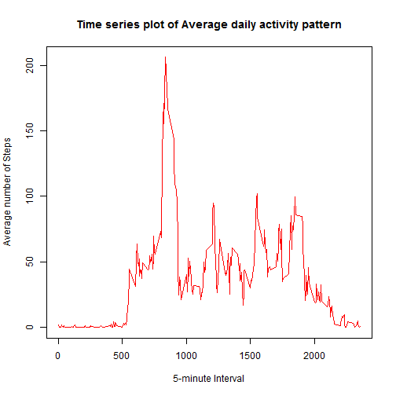
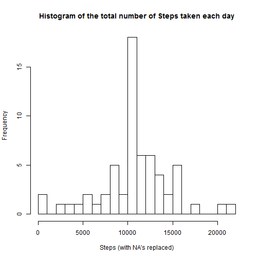
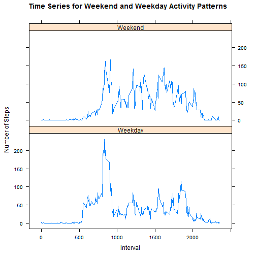

Reproducible Research: Peer Assessment 1
-----------------------------------------

In this project we are going to look at data obtained from an individual who measured their steps over a two month period. The device collected data at 5 minute intervals, recording the number of steps the individual had taken.

Loading and preprocessing the data


```r
activity.data <- read.csv("activity.csv",header = TRUE)
```

What is mean total number of steps taken per day?

1. Make a histogram of the total number of steps taken each day


```r
library(dplyr)
```

```
## 
## Attaching package: 'dplyr'
## 
## The following objects are masked from 'package:stats':
## 
##     filter, lag
## 
## The following objects are masked from 'package:base':
## 
##     intersect, setdiff, setequal, union
```

```r
by.date <- activity.data %>%
                group_by(date) %>%
                summarise(total=sum(steps)) %>%
                arrange(date)

hist(by.date$total,breaks=20,main="Histogram of the total number of Steps taken each day", xlab="Steps")
```

 

2. calculate and report the mean and median total number of steps taken per day


```r
mean.value <- round(mean(by.date$total,na.rm=TRUE),digits=2)
median.value <- round(median(by.date$total,na.rm=TRUE),digits=2)

print(paste("The mean total number of steps taken per day is: ", mean.value))
```

```
## [1] "The mean total number of steps taken per day is:  10766.19"
```

```r
print(paste("The median total number of steps taken per day is: ", median.value))
```

```
## [1] "The median total number of steps taken per day is:  10765"
```

What is the average daily activity pattern?

1. Make a time series plot (i.e. type = "l") of the 5-minute interval (x-axis) and the average number of steps taken, averaged across all days (y-axis)


```r
by.interval <- activity.data %>%
                group_by(interval) %>%
                summarise(average=mean(steps,na.rm=TRUE))


plot(by.interval$interval, by.interval$average, 
     type="l",col = "red",xlab="5-minute Interval", ylab="Average number of Steps", 
     main="Time series plot of Average daily activity pattern")
```

 

2. Which 5-minute interval, on average across all the days in the dataset, contains the maximum number of steps?


```r
by.interval <- arrange (by.interval,desc(average))
max.value <- by.interval[1,1]
print(paste("On the ",max.value,"-th interval, the variable 'steps' attains its maximum"))
```

```
## [1] "On the  835 -th interval, the variable 'steps' attains its maximum"
```

Imputing missing values

Note that there are a number of days/intervals where there are missing values (coded as NA). The presence of missing days may introduce bias into some calculations or summaries of the data.

1. Calculate and report the total number of missing values in the dataset (i.e. the total number of rows with NAs)


```r
count.NA <- sum(is.na(activity.data$steps))

print(paste("The total number of rows with NA's is:",count.NA))
```

```
## [1] "The total number of rows with NA's is: 2304"
```

2. Devise a strategy for filling in all of the missing values in the dataset. The strategy does not need to be sophisticated. For example, you could use the mean/median for that day, or the mean for that 5-minute interval, etc.

I have chosen mean for that 5-minute interval to fill the corresponding missing values.

3. Create a new dataset that is equal to the original dataset but with the missing data filled in.


```r
n <- nrow(activity.data)

replace.NA <- arrange(activity.data, steps)
for (i in 1:count.NA) {
        j = n-count.NA+i
        lookup.value <- replace.NA[j,3]
        match.value <- match(lookup.value,by.interval$interval)
        replace.NA[j,1] <- by.interval[match.value,2]
}

replace.NA <- arrange(replace.NA, date)

replace.by.date <- replace.NA %>%
        group_by(date) %>%
        summarise(total=sum(steps)) %>%
        arrange(date)
```

4. Make a histogram of the total number of steps taken each day and Calculate and report the mean and median total number of steps taken per day. Do these values differ from the estimates from the first part of the assignment? What is the impact of imputing missing data on the estimates of the total daily number of steps?


```r
hist(replace.by.date$total,breaks=20,main="Histogram of the total number of Steps taken each day", xlab="Steps (with NA's replaced)")
```

 

```r
replace.mean.value <- round(mean(replace.by.date$total,na.rm=TRUE),digits=2)
replace.median.value <- round(median(replace.by.date$total,na.rm=TRUE),digits=2)

print(paste("The mean total number of steps taken per day is: ", replace.mean.value))
```

```
## [1] "The mean total number of steps taken per day is:  10766.19"
```

```r
print(paste("The median total number of steps taken per day is: ", replace.median.value))
```

```
## [1] "The median total number of steps taken per day is:  10766.19"
```

```r
MeanMedian <- data.frame(c(mean.value,median.value),
                         c(replace.mean.value,replace.median.value))
colnames(MeanMedian) <- c("NA.omitted","NA.filled")
rownames(MeanMedian) <- c("mean","median")
library(xtable)
xt <- xtable(MeanMedian)
print(xt,type="html")
```

```
## <!-- html table generated in R 3.1.1 by xtable 1.7-4 package -->
## <!-- Mon Sep 15 14:58:51 2014 -->
## <table border=1>
## <tr> <th>  </th> <th> NA.omitted </th> <th> NA.filled </th>  </tr>
##   <tr> <td align="right"> mean </td> <td align="right"> 10766.19 </td> <td align="right"> 10766.19 </td> </tr>
##   <tr> <td align="right"> median </td> <td align="right"> 10765.00 </td> <td align="right"> 10766.19 </td> </tr>
##    </table>
```

```r
rm(xt)

print(paste("Based on the above calculation results, it is clear that the two values do differ from the estimates. Imputing missing data on the estimates of the total daily number of steps, but the impact is not very significant."))
```

```
## [1] "Based on the above calculation results, it is clear that the two values do differ from the estimates. Imputing missing data on the estimates of the total daily number of steps, but the impact is not very significant."
```

Are there differences in activity patterns between weekdays and weekends?

1. Create a new factor variable in the dataset with two levels - "weekday" and "weekend" indicating whether a given date is a weekday or weekend day.


```r
library("lubridate")
replace.NA$date <- ymd(replace.NA$date)
replace.NA$days = wday(by.date$date,label=TRUE)  
replace.NA$week <- weekdays(replace.NA$date) == "Saturday" | weekdays(replace.NA$date) == "Sunday"
replace.NA$week <- factor(replace.NA$week, levels = c(F, T), labels = c("Weekday", "Weekend"))

activity.pattern = aggregate( steps~interval+week, replace.NA, mean)
```

2. Make a panel plot containing a time series plot (i.e. type = "l") of the 5-minute interval (x-axis) and the average number of steps taken, averaged across all weekday days or weekend days (y-axis). The plot should look something like the following, which was creating using simulated data:


```r
library(lattice)
xyplot(steps ~ interval | week, data = activity.pattern, 
       type = "l",layout = c(1,2),ylab = "Number of Steps", 
       xlab = "Interval", main = "Time Series for Weekend and Weekday Activity Patterns")
```

 

There is a clear difference between the weekday and weekend activity patterns. On weekdays the person is doing more activity only in the morning and On the weekends the activity is more upwards and uniform through-out.
